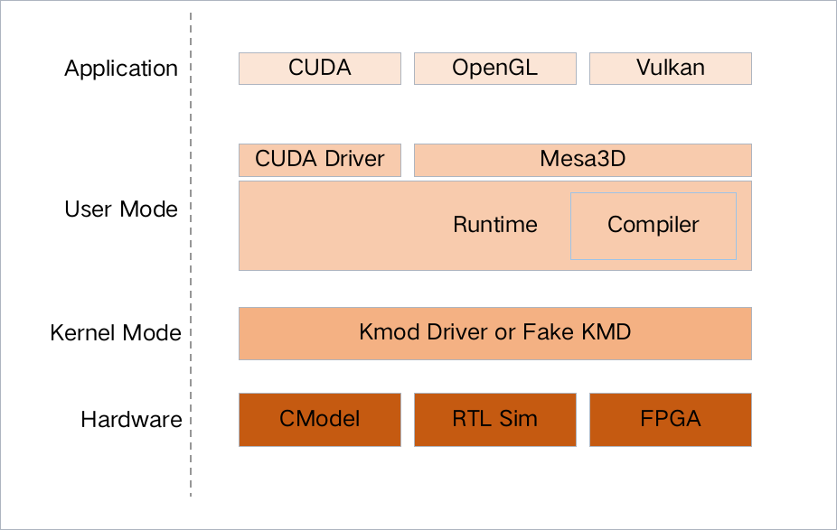

RVGPU 构建和使用
=======================

1. 简介
#######################

1.1 初始化仓库
***********************

RVGPU是一个基于RISC-V指令集实现的开源GPU项目，项目目标是提供一套完整的基于RISC-V指令集的开源GPU软硬件方案。

代码仓库：https://gitee.com/rvgpu

文档：https://rvgpu.github.io/

目前已经发布 v0.2版本，可以支持简单的cuda程序在cmodel上运行。

项目包含的代码仓库如下：

- rvgpu：项目的顶层仓库，通过git submodule的方式来管理所有子项目。
- rvgpu-cmodel：gpu的C模型，用来实现指令集、架构的仿真。
- rvgpu-llvm：编译器工具链，用于实现cuda编译以及rvgpu后端。
- rvgpu-mesa：OpenGL、Vulkan的实现。
- qemu：实现一个虚拟的gpu设备。
- gvm：gpu runtime的实现。
- kmod-drv：内核态驱动。
- tools：一些开发工具。
- docs：项目文档。

项目将实现的框架如下，目前还处于早期阶段，大多数代码还在开发过程中：

2. 如何运行
#######################

2.1 编译源码
***********************
项目整体使用git submodule的方式管理，所以只需要clone顶层仓库就可以拉取所有的代码：
::

    git clone --recursive https://gitee.com/rvgpu/rvgpu.git

涉及到的构建代码比较多，所以在tools仓库下实现了一个构建脚本，可以编译安装所有需要的代码仓库：
::

    cd rvgpu
    ./tools/build/build.sh

编译时间较长，正确执行完脚本后，将安装到当前路径下的install目录下：
::

    qihangkong@st-ubuntu:~/git/rvgpu$ ls install/
    bin  include  lib  libexec  share

还可以直接使用编译好的二进制包：
::

    链接: https://pan.baidu.com/s/14Yg7-wfkixe6oZoTFE75fQ 提取码: mjwa 复制这段内容后打开百度网盘手机App，操作更方便哦

2.2 运行cuda程序
***********************
cuda程序mul.cu如下：
::

    // file: mul.cu
    #include <iostream>

    __global__ void mul(int a, float* x, float* y) {
    y[threadIdx.x] = a * x[threadIdx.x];
    }

    int main(int argc, char* argv[]) {
    const int kDataLen = 4;

    int a = 2;
    float host_x[kDataLen] = {1.0f, 2.0f, 3.0f, 4.0f};
    float host_y[kDataLen];

    // Copy input data to device.
    float* device_x;
    float* device_y;
    cudaMalloc(&device_x, kDataLen * sizeof(float));
    cudaMalloc(&device_y, kDataLen * sizeof(float));
    cudaMemcpy(device_x, host_x, kDataLen * sizeof(float), cudaMemcpyHostToDevice);

    // Launch the kernel.
    mul<<<1, kDataLen>>>(a, device_x, device_y);

    // Copy output data to host.
    cudaDeviceSynchronize();
    cudaMemcpy(host_y, device_y, kDataLen * sizeof(float), cudaMemcpyDeviceToHost);

    // Print the results.
    for (int i = 0; i < kDataLen; ++i) {
        std::cout << "y[" << i << "] = " << host_y[i] << "\n";
    }

    cudaDeviceReset();
    return 0;
    }

使用clang编译cuda：
::

    export PATH=${PWD}/install/bin:${PATH}
    clang++ mul.cu -o mul --cuda-gpu-arch=rv64g -L /usr/lib64 -lcudart -ldl -lrt -pthread

通过--cuda-gpu-arch=rv64g指定编译cuda的目标设备为rvgpu。
运行程序如下：
::

    export LD_LIBRARY_PATH=${PWD}/install/lib
    # 确保应用程序已经链接到指定的动态库上
    qihangkong@st-ubuntu:~/git/rvgpu$ ldd ./mul
    ./mul: /home/qihangkong/git/rvgpu/install/lib/libcudart.so.11.0: no version information available (required by ./mul)
            linux-vdso.so.1 (0x00007ffdc52c9000)
            libcudart.so.11.0 => /home/qihangkong/git/rvgpu/install/lib/libcudart.so.11.0 (0x00007f7f09c3f000)
            libstdc++.so.6 => /lib/x86_64-linux-gnu/libstdc++.so.6 (0x00007f7f09800000)
            libm.so.6 => /lib/x86_64-linux-gnu/libm.so.6 (0x00007f7f09b3c000)
            libgcc_s.so.1 => /lib/x86_64-linux-gnu/libgcc_s.so.1 (0x00007f7f09b1c000)
            libc.so.6 => /lib/x86_64-linux-gnu/libc.so.6 (0x00007f7f09400000)
            librvgpu.so.1.0 => /home/qihangkong/git/rvgpu/install/lib/librvgpu.so.1.0 (0x00007f7f09b15000)
            /lib64/ld-linux-x86-64.so.2 (0x00007f7f09c51000)
            librvgsim.so.0.0.1 => /home/qihangkong/git/rvgpu/install/lib/librvgsim.so.0.0.1 (0x00007f7f09af0000)
            libsoftfloat.so => /home/qihangkong/git/rvgpu/install/lib/libsoftfloat.so (0x00007f7f09ace000)

运行如下：
::

    qihangkong@st-ubuntu:~/git/rvgpu$ ./mul 
    ./mul: /home/qihangkong/git/rvgpu/install/lib/libcudart.so.11.0: no version information available (required by ./mul)
    this is RVGSim
    Run Kernel
    y[0] = 2
    y[1] = 4
    y[2] = 6
    y[3] = 8

3. 问题
#########################
如果有什么问题欢迎随时联系我们：

https://gitee.com/rvgpu 

4. 使用源码编译第三方库
#########################
在开发过程中，往往需要编译构建第三方库，下面的列表是构建第三方仓库的参考文档：

.. toctree::
   :maxdepth: 1

   build_vulkan_demos
